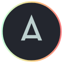

<!-- Copyright (c) 2026 Adam Ousmer. MIT License. See LICENSE.md.
     Forked from EliverLara/Andromeda (VS Code theme, kept in themes/); the JetBrains port lives at the repo root. -->
[forks-shield]: https://img.shields.io/github/forks/AdamOusmer/Andromeda-JetBrains.svg?style=for-the-badge

[forks-url]: https://github.com/AdamOusmer/Andromeda-JetBrains/network/members

[stars-shield]: https://img.shields.io/github/stars/AdamOusmer/Andromeda-JetBrains.svg?style=for-the-badge

[stars-url]: https://github.com/AdamOusmer/Andromeda-JetBrains/stargazers

[issues-shield]: https://img.shields.io/github/issues/AdamOusmer/Andromeda-JetBrains.svg?style=for-the-badge

[issues-url]: https://github.com/AdamOusmer/Andromeda-JetBrains/issues

[license-shield]: https://img.shields.io/badge/License-MIT-green.svg?style=for-the-badge

[license-url]: LICENSE.md

[release-shield]: https://img.shields.io/github/v/release/AdamOusmer/Andromeda-JetBrains?style=for-the-badge

[release-url]: https://github.com/AdamOusmer/Andromeda-JetBrains/releases/latest

[build-shield]: https://img.shields.io/github/actions/workflow/status/AdamOusmer/Andromeda-JetBrains/build.yml?style=for-the-badge

[build-url]: https://github.com/AdamOusmer/Andromeda-JetBrains/actions/workflows/build.yml


<!-- PROJECT LOGO -->
<div align="center">

[![Forks][forks-shield]][forks-url]
[![Stargazers][stars-shield]][stars-url]
[![Issues][issues-shield]][issues-url]
[![MIT][license-shield]][license-url]
[![Release][release-shield]][release-url]
[![Build][build-shield]][build-url]
[](https://ko-fi.com/Q8P121QNHK)

  <a href="https://github.com/AdamOusmer/Andromeda-JetBrains">
    
  </a>

<h3 align="center">Andromeda JetBrains</h3>

  <p align="center">
    The Andromeda VS Code theme, ported 1:1 to JetBrains IDEs.
    <br />
    Built for the new Islands layout. Same hex codes, same fluorescent feel.
    <br />
    <br />
    <a href="https://github.com/AdamOusmer/Andromeda-JetBrains/releases/latest"><strong>Download the latest release »</strong></a>
    <br />
    <a href="https://github.com/AdamOusmer/Andromeda-JetBrains/issues/new?labels=bug">Report Bug</a>
    &middot;
    <a href="https://github.com/AdamOusmer/Andromeda-JetBrains/issues/new?labels=enhancement">Request Feature</a>
    <br />
    <br />
    </p>

[](https://github.com/AdamOusmer)

</div>

***

<!-- TABLE OF CONTENTS -->
<details>
  <summary>Table of Contents</summary>
  <ol>
    <li><a href="#about-the-project">About The Project</a></li>
    <li><a href="#variants">Variants</a></li>
    <li><a href="#installation">Installation</a></li>
    <li><a href="#how-the-port-works">How The Port Works</a>
        <ul>
            <li><a href="#palette">Palette</a></li>
            <li><a href="#islands-mapping">Islands Mapping</a></li>
            <li><a href="#scope-parity-annotators">Scope-Parity Annotators</a></li>
        </ul>
    </li>
    <li><a href="#building">Building</a></li>
    <li><a href="#contributing">Contributing</a></li>
    <li><a href="#license">License</a></li>
    <li><a href="#contact">Contact</a></li>
    <li><a href="#acknowledgements">Acknowledgements</a></li>
  </ol>
</details>

***

## About The Project

[Andromeda](https://github.com/EliverLara/Andromeda) is one of the best-looking dark themes for VS Code: a deep
blue-grey ground with neon cyan, purple, pink and yellow syntax. There was no faithful JetBrains version, so this is one.

Every colour is taken verbatim from the VS Code theme files. The UI theme keeps JetBrains' own Islands layout structure
and swaps the palette; the editor scheme maps Andromeda's TextMate scopes onto IntelliJ's attribute keys. Where
IntelliJ's highlighter cannot express a scope Andromeda relies on, a small annotator fills the gap.

Requires IntelliJ-based IDEs 2025.2 or newer with the new UI.

***

## Variants

| Theme | Editor scheme | What changes |
|---|---|---|
| Andromeda | Andromeda | Base theme |
| Andromeda Italic | Andromeda Italic | Italic comments, keywords and attribute names |
| Andromeda Bordered | Andromeda Bordered | Lighter editor (`#262A33`), visible `#1B1D23` borders |
| Andromeda Italic Bordered | Andromeda Italic Bordered | Both of the above |

***

## Installation

1. Download `andromeda-jetbrains-<version>.zip` from the [latest release](https://github.com/AdamOusmer/Andromeda-JetBrains/releases/latest).
2. *Settings → Plugins → ⚙ → Install Plugin from Disk…* → pick the zip → restart the IDE.
3. *Settings → Appearance & Behavior → Appearance → Theme* → pick a variant. The editor colour scheme switches with it.

Island layout switches on automatically with the theme. Editor font defaults to Menlo 15 with 1.5 line spacing, the VS
Code macOS look; change it under *Settings → Editor → Font* if you prefer another.

***

## How The Port Works

### Palette

| Role | Hex |
|---|---|
| Background | `#23262E` |
| Foreground | `#D5CED9` |
| Cyan (variables) | `#00E8C6` |
| Orange (objects, numbers) | `#F39C12` |
| Yellow (functions, types) | `#FFE66D` |
| Pink (`this`, headings) | `#FF00AA` |
| Hot pink (tags, `${}`) | `#F92672` |
| Purple (keywords, storage) | `#C74DED` |
| Blue (regex) | `#7CB7FF` |
| Red (constants, operators) | `#EE5D43` |
| Green (strings) | `#96E072` |
| Comment | `#A0A1A7` @ 80% |
| Brackets | `#BFC3CC` |

### Islands Mapping

| IntelliJ surface | Andromeda source |
|---|---|
| Frame between islands, toolbar, status bar | `activityBar.background` (Bordered) `#20232B` |
| Islands (editor, tool windows) | `editor.background` `#23262E` (Bordered editor: `#262A33`) |
| Popups, completion | `editorWidget.background` `#20232A`, `editorSuggestWidget.border` |
| Notifications, tooltips | `notification.background` `#2D313B` |
| Inputs, combo boxes | `input.background` `#2B303B`, `dropdown.border` `#363C49` |
| List selection | `list.activeSelectionBackground` (= list bg) + cyan foreground, as in VS Code |
| Active editor tab | `tab.activeForeground` / `tab.activeBorder` `#00E8C6` |
| Buttons, accents | `button.background` `#00E8C5CC`, badge `#00B0FF`, progress `#C668BA` |
| Terminal | `terminal.ansi*` |

Semi-transparent VS Code colours stay `#RRGGBBAA` in the UI theme and are composited over the editor background in the
editor scheme, because IntelliJ editor schemes are opaque.

### Scope-Parity Annotators

IntelliJ's JavaScript highlighter has no equivalent of several TextMate scopes Andromeda colours, so the plugin ships
two annotators that run only while an Andromeda scheme is active:

| VS Code scope | Example | Colour |
|---|---|---|
| `variable.other.object(.property)` | `execa` in `execa.stdout(...)`, `err.stderr` | Orange |
| `entity.name.function` / `support.function` | `homeDir(...)`, `new Listr(...)` | Yellow |
| `constant.language` | `true` `false` `null` `undefined` (JS + Java) | Red |
| `variable.language.this` | `this` (JS) | Pink |

***

## Building

```bash
./gradlew buildPlugin
```

The zip lands in `build/distributions/`. To build against an installed IDE instead of downloading one:

```bash
./gradlew buildPlugin -PlocalIdePath="/Applications/IntelliJ IDEA.app"
```

Theme files are generated. After editing the palette in `tools/gen_ui.py` or `tools/gen_scheme.py`:

```bash
python3 tools/gen_ui.py && python3 tools/gen_scheme.py
```

CI rebuilds them and fails if the committed files drift. Pushing a `v*` tag that matches the Gradle version publishes a
GitHub release with the zip attached.

***

## Contributing

If you have suggestions for how the port could be improved, or want to report a bug, please open an issue.
Pull requests are welcome; keep colour changes traceable to a VS Code theme key.

***

## License

MIT. See the [LICENSE](LICENSE.md) file for details. Andromeda's palette is © Eliver Lara, MIT.

***

## Contact

Adam Ousmer - [GitHub](https://github.com/AdamOusmer) - [Email](mailto:contact@adam-ousmer.dev)

***

## Acknowledgements

- [Eliver Lara](https://github.com/EliverLara) for Andromeda
- README template inspired by [othneildrew/Best-README-Template](https://github.com/othneildrew/Best-README-Template)
